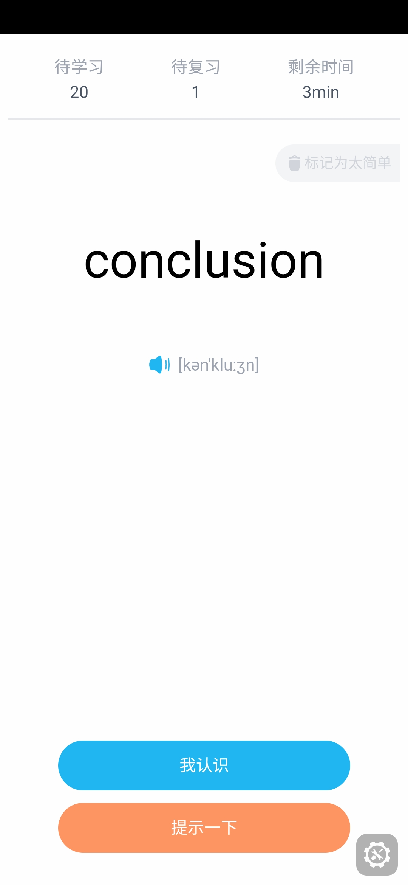
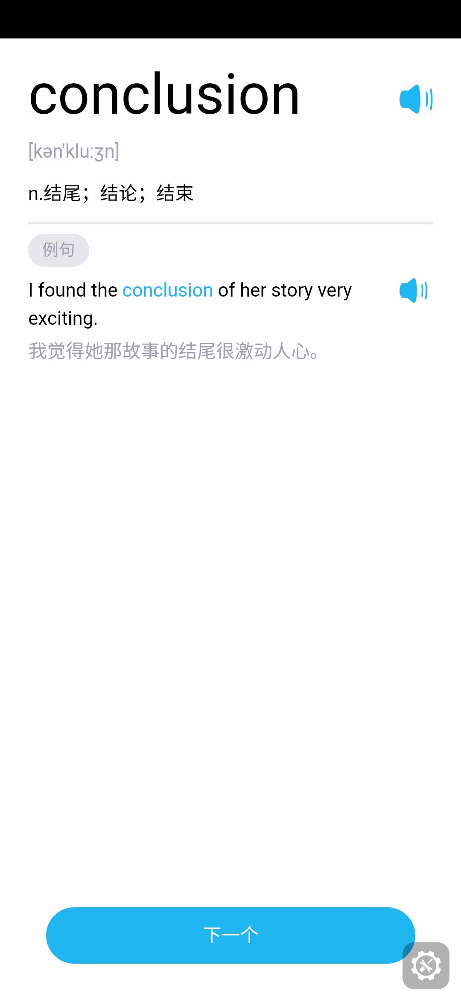

# 扇贝单词 Anki 模版

## 📃 这是啥子

一个高仿扇贝单词界面的 Anki 词汇模版，目前只能在 Ankidroid 上使用。

## 🍽 如何食用

下载 apkg 目录下的 anki-template-shanbay.apkg 导入 Anki 即可。

## 😪 还没做的

### 总体

- [ ] 重构代码

### 样式

- [x] 间距过大
- [x] 空间分配不合理

### 功能

- [ ] 记错了按钮
- [ ] 撤销功能
- [ ] 无例句提醒
- [ ] 回答标识

### 改进

- [ ] 音频音量不一致

### BUG

- [ ] 没有音标无法重播

### 构建

- [x] 改进打包

## 📷 截图预览

