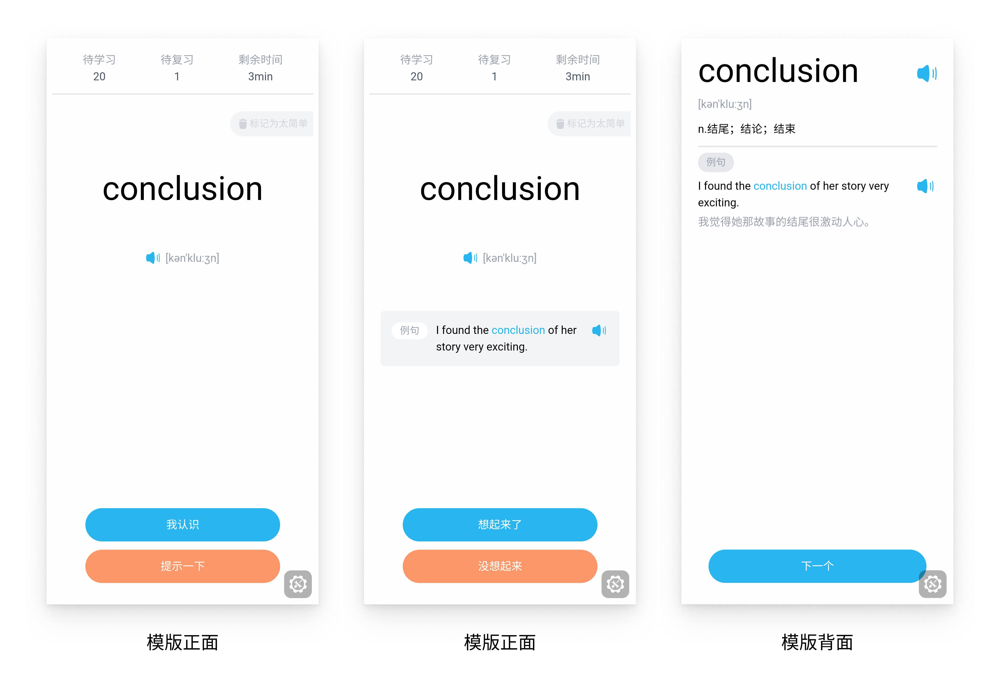

# anki-template-shanbay

[简体中文](https://github.com/Z233/anki-template-shanbay/blob/master/readme.md) | English

## 📃 Introduction

An anki vocabulary template inspired by shanbay english vocabulary app. Currently it is only available on Ankidroid.

## ⭐️ Features

- Custom Answer Button
- Learning Status
- Sentence Hint
- Night mode support
 
## 🍽 Usage

1. Download [anki-template-shanbay.apkg](https://github.com/Z233/anki-template-shanbay/blob/master/apkg/anki-template-shanbay.apkg) desk file from the apkg directory and import it into Ankidroid.
2. In Ankidroid, Settings > Gestures, enable gestures and set all actions to no action.
3. In Ankidroid, Settings > Reviewing, set fullscreen mode to hide the system status bars and answer buttons.
4. Enjoy!

## 📷 Screenshots

## 🔨 Techniques

- [vite](https://github.com/vitejs/vite)
- [tailwindcss](https://github.com/tailwindlabs/tailwindcss)
- [anki-persistence](https://github.com/SimonLammer/anki-persistence)